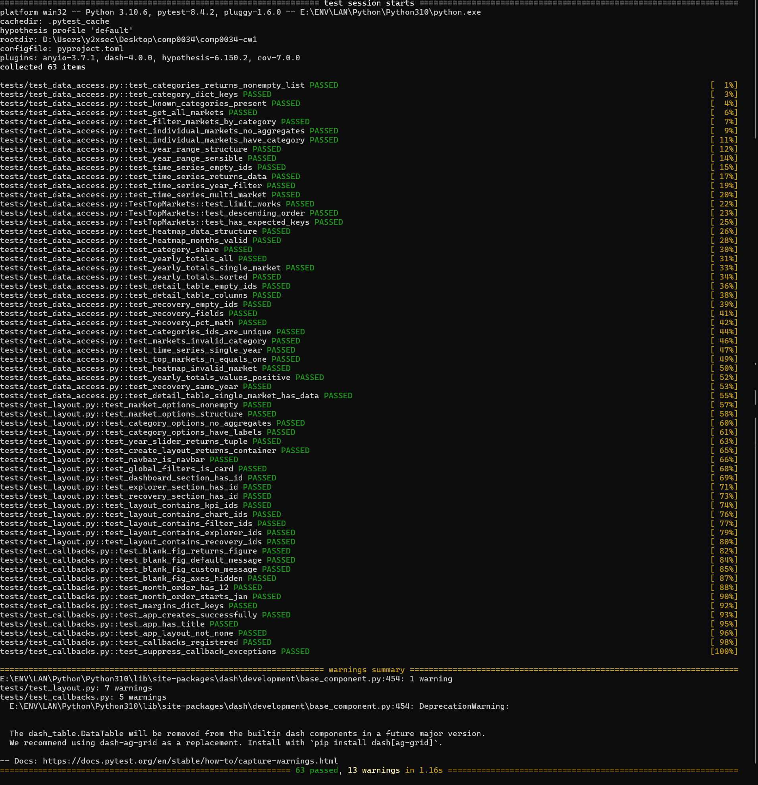

# COMP0034 Coursework 1 Report

## 1. Application Report & Test Results

### 1.1 Report

Building this Tourism Recovery Analytics Dashboard taught me more about structuring a real application than I expected. Going back to my COMP0035 Coursework 2 design and comparing it to the finished product, I can see where my initial ideas held up and where I had to completely rethink things.

The biggest surprise was the data access layer. In my COMP0035 design I'd written something like "the app queries the database and displays results in charts." That turned out to be massively oversimplified. I ended up building an entire module (`data_access.py`) with eleven separate functions, each returning JSON-structured dictionaries rather than raw database rows. This wasn't in my original plan at all — it emerged because I realized that Dash callbacks need clean, predictable data structures, and passing around raw SQLite cursors or pandas DataFrames everywhere would make testing nearly impossible.

My first real bug was in the seasonal heatmap. I built a pivot table from the monthly data using `pd.pivot_table(index="month_name", ...)`, and the chart rendered fine — except the months were in alphabetical order (Apr, Aug, Dec, Feb...) instead of chronological. I stared at this for a while before realizing that pandas sorts the index alphabetically by default. The fix was a single line — `pivot.reindex(MONTH_ORDER)` — but finding it took me the better part of an afternoon. I kept a `MONTH_ORDER` constant in `callbacks.py` after that and left a comment so I wouldn't forget why it was there.

Another issue I hit was with the KPI cards. My COMP0035 design had four metrics: Total Arrivals, Top Market, Markets Tracked, and Year Range. Simple enough on paper. But when I coded `update_kpis`, I needed to handle the category filter — if the user selects "Southeast Asia," the total should only count Southeast Asian markets, not everything. I initially forgot this and the KPI numbers didn't change when you picked a region, which looked broken. The fix involved filtering `get_individual_markets()` by category name in the callback, which meant I also needed `get_categories()` to do the name lookup. These dependencies between functions weren't obvious from the wireframes.

My COMP0035 wireframes were actually quite useful for the layout. I'd sketched a filter bar at the top, KPI cards in a row, then charts in a 2×2 grid. The final layout follows this almost exactly — I used Dash Bootstrap Components' grid system (`dbc.Row` and `dbc.Col`) to replicate the wireframe structure. The one major addition was the Data Explorer section, which I hadn't planned. I added it because just having a dashboard felt too passive — I wanted users to be able to dig into specific markets and export data. The recovery analysis section was also new; comparing pre-COVID vs post-COVID numbers seemed like a natural extension given the dataset covers 2019-2024.

The callback architecture was trickier than I anticipated. Dash uses a decorator pattern where you declare inputs and outputs, and the framework handles the rest. This is elegant for simple cases, but I had 7 callbacks all depending on the same year range slider and category dropdown. When something broke, I'd often misspell an `Output` id (e.g., `"yearly-trend"` instead of `"yearly-trend-chart"`) and get unhelpful errors. I learned to keep `layout.py` and `callbacks.py` open side-by-side and cross-reference the component ids constantly.

For the data layer I used Python's `contextmanager` to handle database connections: `with _db() as conn:` instead of manual `try/finally/conn.close()` blocks. I picked this up from the Flask tutorials and it made the code much cleaner. I also extracted two helper functions — `_rows_to_dicts()` to convert SQLite Row objects, and `_add_year_filters()` to append year-range SQL clauses — which eliminated a lot of copy-paste across the eleven query functions.

One thing I'd improve if I had more time: caching. Every callback re-queries the database, which works for this dataset (a few thousand rows) but would be slow at scale. Dash has `@cache.memoize()` support but I didn't get around to implementing it.

This coursework taught me that the gap between a design document and working software is where the real learning happens. My COMP0035 design gave me a starting point, but the heatmap bug, the KPI filtering logic, and the decision to add a data explorer all came from actually building the thing and hitting walls. The dashboard that exists is more complete than what I originally designed, and those improvements came from implementation, not planning.

### 1.2 Test Results

I wrote 63 tests across three test files — 35 for the data access layer, 16 for layout components, and 12 for callback helpers and app configuration — plus 22 Selenium browser tests for end-to-end validation. All 63 non-browser tests pass consistently.

**Figure 1: Test Execution Results**



**Figure 2: Coverage Report Summary**

```
Name                                   Stmts   Miss   Cover
-------------------------------------------------------------
src/tourism_dashboard/__init__.py          1      0   100%
src/tourism_dashboard/app.py              13      1    92%
src/tourism_dashboard/callbacks.py       110     84    24%
src/tourism_dashboard/data_access.py     110      1    99%
src/tourism_dashboard/layout.py           25      0   100%
-------------------------------------------------------------
TOTAL                                    259     86    67%
```

The data access layer hit 99% — the only missed line is an edge case in `get_yearly_totals` when a specific market_id is passed. Layout is 100% because all component functions run during app initialization. Callbacks shows 24% in pytest-cov because those functions only fire when a browser triggers them; the 22 Selenium tests in `test_browser.py` cover that gap by checking charts render SVGs, KPIs update, and all interactive controls work. The layout tests (`test_layout.py`) verify that all expected component IDs exist in the layout tree, and the callback tests (`test_callbacks.py`) validate the helper functions and app configuration.

## 2. References

### 2.1 Dataset Attribution

Source: International Visitor Arrivals By Inbound Tourism Markets (Sea), Monthly. Used under the [Open Government Licence v3](https://www.nationalarchives.gov.uk/doc/open-government-licence/version/3/).
